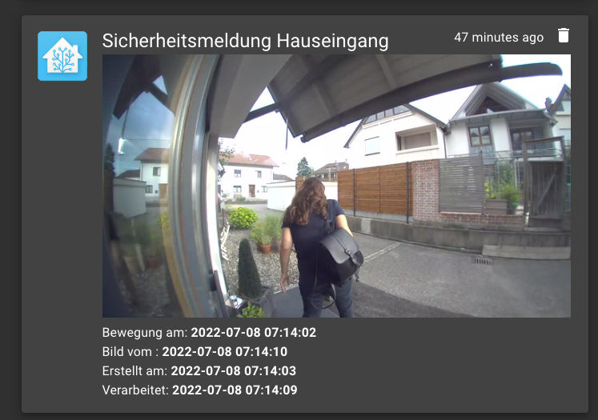

## RING MQTT Testcase


## Result - NO security with RING Doorbell !

After a few attempts, I have to realize that it is only possible to save a camera image to a limited extent with the Ring service when motion is detected. Sometimes it works, sometimes it saves the wrong image.

The Ring APP (Android version) has the same problem. Even there, the corresponding image is not always displayed when motion is detected.




## Requirements
Ring MQTT (ring-mqtt:4.9.1)
see: https://github.com/tsightler/ring-mqtt

## Hardware
Video Doorbell Wired + Chime (no Ring Protect Plan)


## Docker Install
```bash
#!/bin/bash
source .env

# -----------------------------------------------------------------
# sudo bash ring.sh
# netstat -lntu | grep 8554
# see: https://github.com/tsightler/ring-mqtt/blob/main/docs/DOCKER.md#authentication
# -----------------------------------------------------------------
IDu=$(id -u) # UID
IDg=$(id -g) # GID
CURRENTURL=http://$(hostname).$(dnsdomainname)
DOCKER_APPSDIR=/apps/
DOCKER_RINGPORT8554=8554
DOCKER_TIMEZONE=Europe/Berlin
## all others see .env file

DOCKERIMAGE=tsightler/ring-mqtt:4.9.1
CONTAINERLABEL=ring-mqtt
APPSDATA=$PWD${DOCKER_APPSDIR}${CONTAINERLABEL}

echo "Create persistent backup, data folder and config folder"
mkdir -p ${APPSDATA}/data >/dev/null 2>&1

echo "Try to remove previuos installation..."
docker stop ${CONTAINERLABEL} >/dev/null 2>&1
docker rm ${CONTAINERLABEL} >/dev/null 2>&1

echo "Install Docker container ${CONTAINERLABEL}."
docker run --detach --interactive \
  --name="${CONTAINERLABEL}" \
  --hostname=${CONTAINERLABEL} \
  --publish "${DOCKER_RINGPORT8554}:8554" \
  --restart unless-stopped \
  --volume "/etc/localtime:/etc/localtime:ro"   \
  --volume "${APPSDATA}/data:/data"  \
  --env TZ=${DOCKER_TIMEZONE} \
  --env RINGTOKEN="${RING_TOKEN}"   \
  --env MQTTHOST="${MQTT_BROCKER}"  \
  --env MQTTPORT="${MQTT_BROCKER_PORT}" \
  --env MQTTUSER="${MQTT_BROCKER_USER}" \
  --env MQTTPASSWORD="${MQTT_BROCKER_PASSWORD}" \
  --env ENABLECAMERAS=true \
  --env SNAPSHOTMODE=all \
  --env ENABLECAMERAS=true \
  --env ENABLECAMERAS=true \
  --env DEBUG="ring-mqtt" \
  ${DOCKERIMAGE}

echo "Docker container:  ${CONTAINERLABEL} ready."
echo "RTSP  Connection:  ${CURRENTURL}:${DOCKER_RINGPORT8554}"
```

## Install testcase

On a modern Linux system just a few steps are needed to get the daemon working. The following example 
shows the installation under Debian/Raspbian below the `/opt` directory:

```bash
$ git clone https://github.com/zibous/ring-mqtt-test.git /opt/ring-mqtt-test
$ cd /opt/ring-mqtt-test
$ sudo pip3 install -r requirements.txt
$ cp config.py.dist config.py
```
Edit `config.py.dist` and change the mqtt settings.

## Run testcase
`python3 app.py -l DEBUG`
